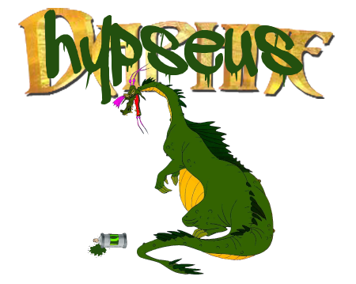

# Hypseus Singe

Hypseus is a fork of [Matt Ownby's][CUS] [Daphne].

A program to play laserdisc arcade games on a PC, Mac or Raspberry Pi.

This version includes **Singe** support for Fan Made and [American Laser Games][ALG].

Features:

* SDL2 support
* Updated MPEG2 decoder
* Daphne VLDP 32bit upgrade
* Integrated _(active)_ [bezel](screenshots/bezel.png?raw=true) support
* Daphne and Singe 4k 4Gb+ M2V support
* Singe EmulationStation LUA path integration
* Singe Joystick, Lightgun _EV_ABS_ [mouse] support
* Singe 2 full 32bit overlay support (details below)
* Sinden support in Singe games
* For Singe games list see [here](https://github.com/DirtBagXon/hypseus_singe_data).
* Daphne alternate overlay choices
* Multiple *GameController* (*hotplug*) support: [config](doc/hypinput_gamepad.ini)
* Advanced configuration and multi-joystick support: [config](doc/hypinput.ini)
* 'lair/ace' [hardware](https://github.com/DirtBagXon/hypseus_scoreboard) and [software](screenshots/scoreboard.png?raw=true) original scoreboards.
* 64bit Windows and MacOS X Ports
* Coded exclusively in [vim](https://www.vim.org) using a Sun Microsystems [Type 5c keyboard](https://github.com/DirtBagXon/sunkbd).

## Windows

**Windows** files and documentation can be found [here](win32/)

## Compile

Minimum software requirements: [gcc], [cmake], [autotools], [zlib], [SDL2],
[libtool], [libzip], [vorbis] and [ogg].

### MacOS X

Use homebrew to install the following packages:

    brew install cmake
    brew install autoconf
    brew install automake
    brew install pkg-config
    brew install sdl2
    brew install sdl2_ttf
    brew install sdl2_image
    brew install sdl2_mixer
    brew install libtool
    brew install libvorbis
    brew install libogg
    brew install libzip

Newer series Macs may need to use the _brew_ `libmpeg2` package:

    brew install libmpeg2

Then clone the `libmpeg2` branch:

    git clone --single-branch --branch libmpeg2 https://github.com/DirtBagXon/hypseus-singe.git

### Raspberry Pi

For **Raspberry Pi** clone the ``RetroPie`` branch via:

    git clone --single-branch --branch RetroPie https://github.com/DirtBagXon/hypseus-singe.git

Further **RetroPie** and **Raspberry Pi** information can be found [here](doc/RETROPIE.md)

### Compilation with CMake

Build:

    mkdir build
    cd build
    cmake ../src
    make

## Install and Run

Ensure you have data in the following `daphne` HOME folders:

    pics, fonts, ram, roms, midi, sound, singe, (vldp and vldp_dl)

Run `hypseus` with `daphne` [arguments](doc/CmdLine.md) on the command line:

    hypseus lair vldp -framefile vldp_dl/lair/lair.txt -scorebezel

    hypseus singe vldp -framefile singe/timegal/timegal.txt -script singe/timegal/timegal.singe

In **Windows** you are able to create `.bat` files with arguments for specific games.

Example `.bat` files  are provided within the [Windows](win32/) zip file.

**Retro gaming** systems will require adoption within the relevant emulation scripts.

The singe `-retropath` argument can ease integration into EmulationStation style systems.

`bash` scripts are provided for systems that support this shell.

**Build Hypseus home and install bash scripts:**

    mkdir -p ~/.daphne/roms ~/.daphne/ram ~/.daphne/vldp
    mkdir -p ~/.daphne/vldp_dl ~/.daphne/singe
    cp -R pics sound fonts midi ~/.daphne
    
    sudo cp build/hypseus /usr/local/bin/hypseus.bin
    sudo cp scripts/run.sh /usr/local/bin/hypseus
    sudo cp scripts/singe.sh /usr/local/bin/singe
    hypseus
    singe

## Input Configurations

Configuration of button keycodes and joysticks should be made within [hypinput.ini](doc/hypinput.ini)

By default SDL2 Keycodes and the Joystick API configuration options will be used.

Use the [hypjsch](https://github.com/DirtBagXon/hypjsch) utilities to help with advanced scancode configurations.

Refer to [keylist.txt](doc/keylist.txt) for **SDL2** keycode values.

SDL GameController API configuration can now be enabled for supported controllers.

Enable **SDL_GameController** using `-gamepad`. Example config: [hypinput_gamepad.ini](doc/hypinput_gamepad.ini)

Update the Controllers _db_ by placing `gamecontrollerdb.txt` in the Hypseus home folder.

## Screenshots

*(Click images for YouTube playlist)*

## Altering Hypseus or Singe ROM locations in bash scripts

Edit **run.sh** and **singe.sh**, to reflect the location of your ROM folders:

    HYPSEUS_SHARE=~/.daphne

**Note:** The default Hypseus home directory, *created* when run without ``-homedir``:

    ~/.hypseus

## Bezels

Bezel arguments are documented in: [Bezels.md](doc/Bezels.md)

## Hardware USB Scoreboard

Example arguments: `-usbscoreboard COM 4 19200`

Full details of the USB scoreboard [here](https://github.com/DirtBagXon/hypseus_scoreboard).

## Software Scoreboard

Enable the software external [scoreboard panel](screenshots/scoreboard.png?raw=true) in lair/ace: `-scorepanel`.  
Use `KEY_TILT` to switch displays when using multiple screens.

A *bezel* based alternate is also available via: `-scorebezel`

The scorepanel, or bezel, can be positioned using `-scorepanel_position x y` - *Window Managers* may influence placement of the panel, *scorebezel* is not under their influence. The `-scorebezel_alpha` argument is a transparency option for the bezel based scoreboard.

## Singe

For Singe, provide the following arguments to *hypseus*:

    hypseus singe vldp -framefile ~/.daphne/singe/timegal/timegal.txt -script ~/.daphne/singe/timegal/timegal.singe -homedir ~/.daphne/ -datadir ~/.daphne/

Check for Singe anomalies and replacement files [here](https://github.com/DirtBagXon/hypseus_singe_data).

## Singe 2

Hypseus Singe has support for Singe 2 games, including full 32bit overlays.

For current details see: [Hypseus Singe Data](https://github.com/DirtBagXon/hypseus_singe_data)

## Lightguns

Singe supports Sinden and DolphinBar based lightguns with the `-manymouse` argument.

This argument enables *absolute* (``EV_ABS``) mouse input event codes.

**Note:** `-sinden` automatically enables `-manymouse`

## Singe joystick [mouse] support

Singe now automatically interprets **joystick axis** change as mouse movement (*Gun Games*).

Adjust sensitivity via `-js_range <1-20>` in Singe arguments, or disable with `-nojoymouse`

Configure **joystick controls** in [hypinput.ini](doc/hypinput.ini) or via [GameController](doc/hypinput_gamepad.ini)

## Game Configuration arguments

Refer to [CmdLine.md](doc/CmdLine.md) for the full argument list.

## Support

This software intended for educational purposes only. Please submit [issues] or
[pull requests] directly to the [project].

**DO NOT submit issues or request support from the official Daphne forums!**

## About

Open development by the original author, [Matt Ownby][CUS], ceased years ago.

Singe was created by [Scott Duensing][SD] as a plugin to Daphne to allow the
playing of [American Laser Games][ALG].

This repository was created to expand the ``Hypseus`` project started
by [Jeffrey Clark][JAC]. Many overlays were unimplemented in the original
repository. Singe had also been removed.

The name of this application was changed to _Hypseus_ (_[sibling to Daphne][peneus]_)
so the original authors of [Daphne] would not be burdened with requests for support.

A massive thanks goes out to [Matt Ownby][CUS], [Scott Duensing][SD], [Jeffrey Clark][JAC],
[Manuel Alfayate][MAC], [David Griffith][DG] and the many other developers
who made their work available for me to build upon. Without them this
project would not be possible.

## License

**Hypseus Singe**, Being Retro Orientated This Humble Emulator Regenerates  
Copyright (C) 2021-2025  [DirtBagXon][owner]

**Hypseus**, Multiple Arcade Laserdisc Emulator  
Copyright (C) 2016  [Jeffrey Clark][JAC]

**Daphne**, the First Ever Multiple Arcade Laserdisc Emulator  
Copyright (C) 1999-2013  [Matt Ownby][CUS]

[][GNU General Public License]

    This program is free software: you can redistribute it and/or modify
    it under the terms of the [GNU General Public License] as published by
    the Free Software Foundation, either version 3 of the License, or
    (at your option) any later version.
    
    This program is distributed in the hope that it will be useful,
    but WITHOUT ANY WARRANTY; without even the implied warranty of
    MERCHANTABILITY or FITNESS FOR A PARTICULAR PURPOSE.  See the
    [GNU General Public License] for more details.

## Trademark

The "Hypseus Singe" mark is used to uniquely identify this project as an Arcade
Laserdisc Emulator.  __Any direct or indirect commercial use of the mark
"Hypseus" is strictly prohibited without express permission.__

[owner]: https://github.com/DirtBagXon
[project]: https://github.com/DirtBagXon/hypseus-singe
[issues]: https://github.com/DirtBagXon/hypseus-singe/issues
[pull requests]: https://github.com/DirtBagXon/hypseus-singe/pulls
[Daphne]: http://www.daphne-emu.com
[CUS]: http://www.daphne-emu.com/site3/statement.php
[gcc]: https://gcc.gnu.org/
[zlib]: http://www.zlib.net/
[libzip]: https://libzip.org/
[libzippp]: https://github.com/ctabin/libzippp
[libmpeg2]: http://libmpeg2.sourceforge.net/
[SDL2]: https://www.libsdl.org/download-2.0.php
[SDL2_image]: https://www.libsdl.org/projects/SDL_image/
[SDL2_mixer]: https://www.libsdl.org/projects/SDL_mixer/
[SDL2_ttf]: https://www.libsdl.org/projects/SDL_ttf/
[SDL2_gfx]: https://sourceforge.net/projects/sdl2gfx/
[ManyMouse]: https://github.com/icculus/manymouse
[serialib]: https://github.com/imabot2/serialib
[plog]: https://github.com/SergiusTheBest/plog
[GLEW]: http://glew.sourceforge.net/
[ogg]: https://en.wikipedia.org/wiki/Ogg
[vorbis]: https://en.wikipedia.org/wiki/Vorbis
[cmake]: https://cmake.org
[lua]: https://lua.org/
[lua_cjson]: https://github.com/mpx/lua-cjson
[lua_md5]: https://github.com/lunarmodules/md5
[lua_sha2]: https://code.google.com/archive/p/sha2/
[luars232]: https://github.com/ynezz/librs232
[lua_bitop]: https://bitop.luajit.org/index.html
[luafilesystem]: https://lunarmodules.github.io/luafilesystem/
[autotools]: https://en.wikipedia.org/wiki/GNU_Build_System
[libtool]: https://www.gnu.org/software/libtool/manual/libtool.html
[peneus]: https://en.wikipedia.org/wiki/Peneus
[GNU General Public License]: http://www.gnu.org/licenses/gpl-3.0.en.html
[JAC]: https://github.com/h0tw1r3
[MAC]: https://github.com/vanfanel
[ALG]: https://en.wikipedia.org/wiki/American_Laser_Games
[SD]: https://github.com/sduensin
[DG]: https://github.com/DavidGriffith
